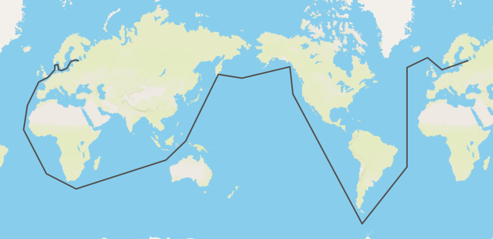

# Кругосветное путешествие Ивана Фёдоровича Крузенштерна
Карта построена по [статье](https://pomnisvoih.ru/velikie-lyudi-rossii/puteshestvenniki/russkij-pervootkryvatel-ivan-fyodorovich-kruzenshtern.html). 

Иван Фёдорович отличался атлетическим телосложением, невзирая на недоумение коллег, возил с собой гири, и каждый день занимался с ними.
Иван Фёдорович Крузенштерн свою жизнь посвятил изучению мирового океана. Участвовал в кругосветных экспедициях и создал множество научных трудов, впервые нанес на карту большую часть побережья острова Сахалин, стал одним из учредителей Русского географического общества. Карта фиксирует все точки его маршрута в кругосветном путешествии.

*Карта выглядит так*

